# BR30 Trader

🚀 **BR30 Trader** is a modern trading education platform built using **React.js, Vite, Node.js, Express.js and MongoDB**.

---

## 🌐 Live Website

[🚀 Visit BR30 Trader](https://my-frontend-eight-roan.vercel.app/)

---

## 🌟 Features

- User Registration & Login
- OTP Verification System
- Course Purchase System
- Premium Trading Courses
- Student Dashboard
- Admin Dashboard
- Profile Management
- Notification System
- SEO Optimized Pages
- Mobile Responsive Design

---

## 🛠️ Tech Stack

### Frontend


---

### Backend


---

### Integrations


---

### Deployment


---

### Development Tools


---

# 📁 Project Structure

```bash
br30trader.com-f
│
├── public/
│   ├── course-files/
│   ├── images/
│   ├── videos/
│   ├── favicon.ico
│   ├── favicon.svg
│   ├── icons.svg
│   ├── robots.txt
│   └── sitemap.xml
│
├── src/
│   │
│   ├── assets/
│   │   ├── hero.png
│   │   ├── react.svg
│   │   └── vite.svg
│   │
│   ├── components/
│   │   ├── Navbar.jsx
│   │   ├── FooterSection.jsx
│   │   ├── Leaderboard.jsx
│   │   ├── ScrollToTop.jsx
│   │   ├── CoursesSection.jsx
│   │   ├── CourseHighlightsSection.jsx
│   │   ├── ServicesSection.jsx
│   │   ├── PdfHubSection.jsx
│   │   ├── ReviewSection.jsx
│   │   ├── PatternSection.jsx
│   │   ├── PillarsSection.jsx
│   │   ├── TradingMastery.jsx
│   │   ├── TradingUniverseSection.jsx
│   │   ├── TradingMindsetSection.jsx
│   │   ├── TradingToolsSection.jsx
│   │   ├── TradingJournalSection.jsx
│   │   └── TradingUpdatesSection.jsx
│   │
│   ├── context/
│   │   └── AuthContext.jsx
│   │
│   ├── hooks/
│   │   └── useShortcuts.js
│   │
│   ├── routes/
│   │   ├── AppRoutes.jsx
│   │   └── VipProtectedRoute.jsx
│   │
│   ├── pages/
│   │   ├── Home.jsx
│   │   ├── Login.jsx
│   │   ├── Register.jsx
│   │   ├── ForgotPassword.jsx
│   │   ├── Reset.jsx
│   │   ├── MyProfile.jsx
│   │   ├── MyCourse.jsx
│   │   ├── CourseWatch.jsx
│   │   ├── UserReview.jsx
│   │   ├── CertificateVerify.jsx
│   │   │
│   │   ├── AdminDashboard.jsx
│   │   ├── Br30UserManagement.jsx
│   │   ├── Br30CourseEdit.jsx
│   │   ├── Br30LoadCourse.jsx
│   │   ├── BR30Announcement.jsx
│   │   ├── BellViewAlert.jsx
│   │   ├── Br30BellNotification.jsx
│   │
│   │   ├── Br30AboutUs.jsx
│   │   ├── Br30Contact.jsx
│   │   ├── Br30TermsCondition.jsx
│   │   ├── Br30UserPrivacy.jsx
│   │   ├── Br30RefundPolocy.jsx
│   │   ├── Disclaimer.jsx
│   │   ├── Br30SupportCommunity.jsx
│   │   ├── Br30FounderAbout.jsx
│   │   ├── Br30VipAccess.jsx
│   │   ├── Br30WebService.jsx
│   │
│   │   ├── BasicToAdvance.jsx
│   │   ├── TechnicalAnalysisMastery.jsx
│   │   ├── PriceActionMastery.jsx
│   │   ├── CandlestickPatternsGuide.jsx
│   │   ├── ChartPatternsSignals.jsx
│   │   ├── SupportResistanceLevels.jsx
│   │   ├── TrendAnalysisTechniques.jsx
│   │   ├── VolumeAnalysisTechniques.jsx
│   │   ├── RiskManagement.jsx
│   │   ├── RiskManagementTechniques.jsx
│   │   ├── ScalpingTechniques.jsx
│   │   ├── SwingTradingStrategies.jsx
│   │   ├── IntradayTradingTechniques.jsx
│   │
│   │   ├── EMATradingStrategy.jsx
│   │   ├── EMAFVGOptionBuying.jsx
│   │   ├── EMAFVGOptionSelling.jsx
│   │   ├── FairValueGapTrading.jsx
│   │   ├── FibonacciRetracementStrategy.jsx
│   │   ├── BollingerBandsTradingSetup.jsx
│   │   ├── MACDIndicatorExplained.jsx
│   │   ├── RSIStochasticIndicators.jsx
│   │   ├── RSIDivergenceFullGuide.jsx
│   │
│   │   ├── OptionsBasicsForBeginners.jsx
│   │   ├── OptionBuyingGuide.jsx
│   │   ├── OptionSellingGuide.jsx
│   │   ├── OptionGreeksMastery.jsx
│   │   ├── OptionSellingWithHedging.jsx
│   │   ├── OptionHedgingStrategies.jsx
│   │   ├── AdvancedOptionsStrategies.jsx
│   │   ├── BullishOptionStrategies.jsx
│   │   ├── BearishOptionStrategies.jsx
│   │   ├── NeutralVolatilityOptionStrategies.jsx
│   │   └── OtherOptionStrategies.jsx
│   │
│   ├── App.jsx
│   ├── App.css
│   ├── index.css
│   └── main.jsx
│
├── .env
├── .gitignore
├── .prettierrc
├── eslint.config.js
├── index.html
├── package.json
├── package-lock.json
├── vite.config.js
├── vercel.json
└── README.md
```
---

## 📸 Screenshots

### 🏠 Home Page

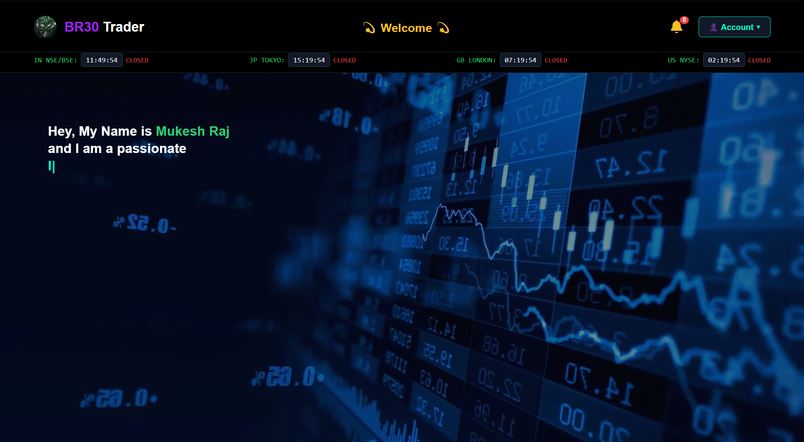

---

### 📚 Course Page

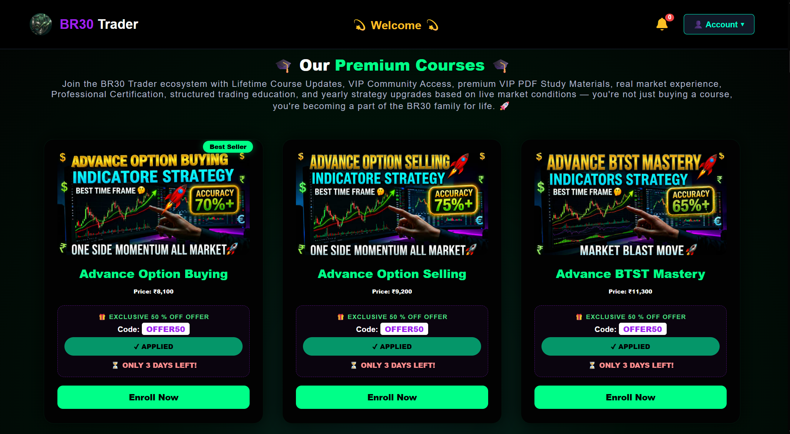

---

### 📚 Course Page 2

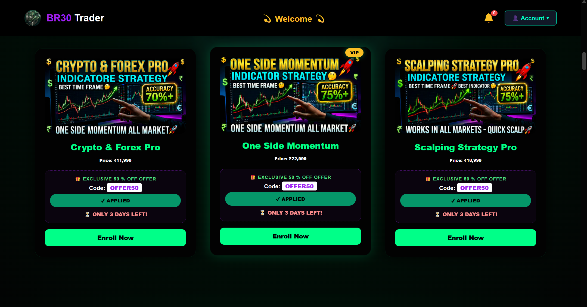

---

### 🔐 Login Page

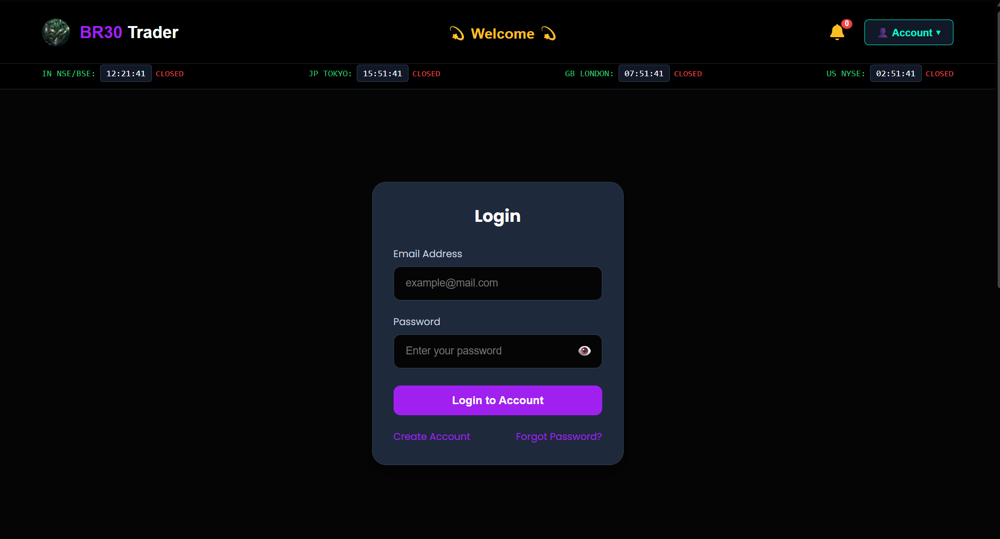

---

### 📝 Register Page

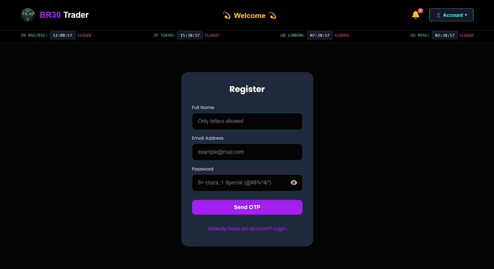

---

### 🔁 Reset Password Page

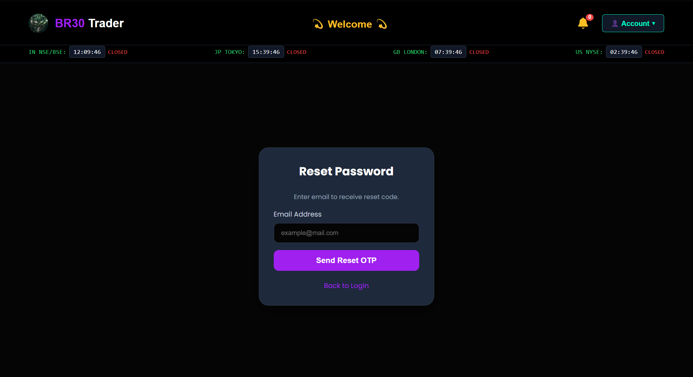

---

### 👤 My Profile

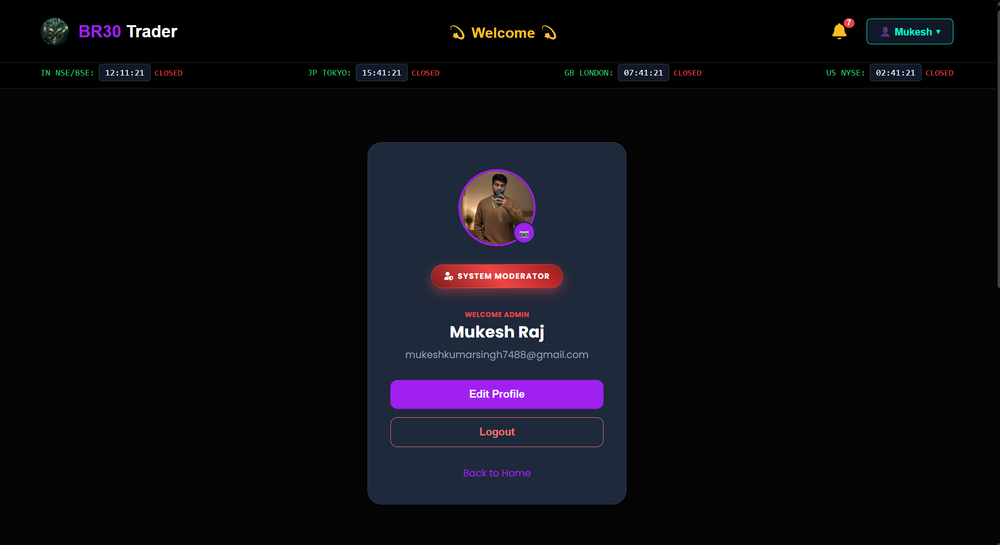

---

### 🎓 My Course

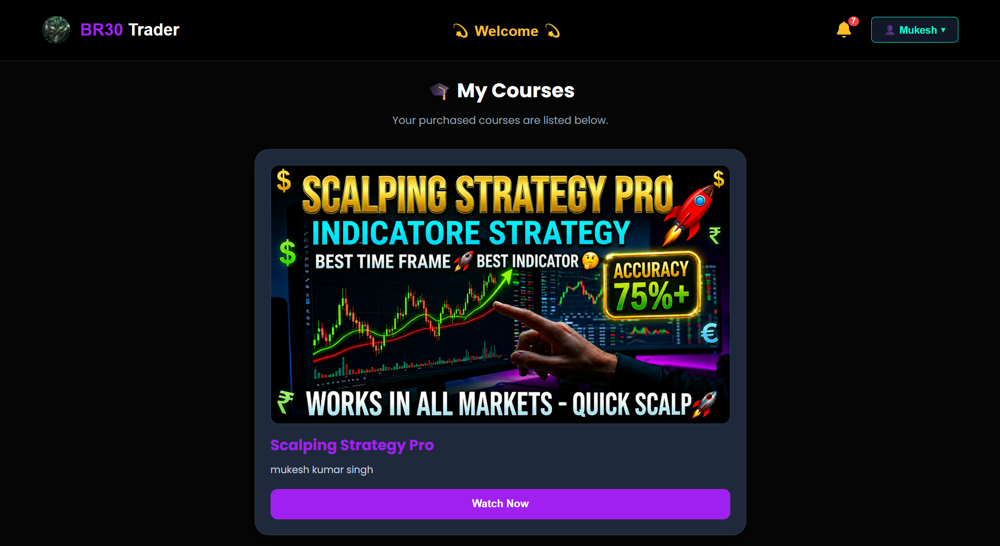

---

### 📘 PDF Hub

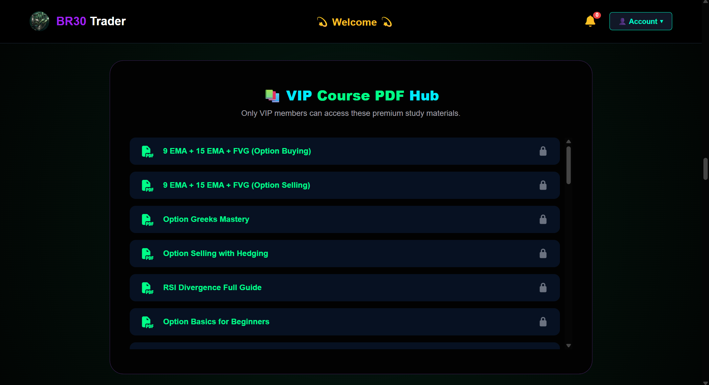

---

### 🏆 Top VIP Section

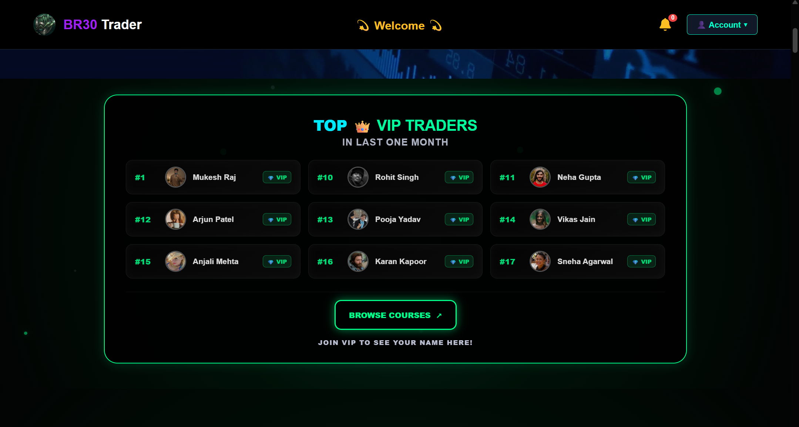

---

### 📈 Student Trade Page

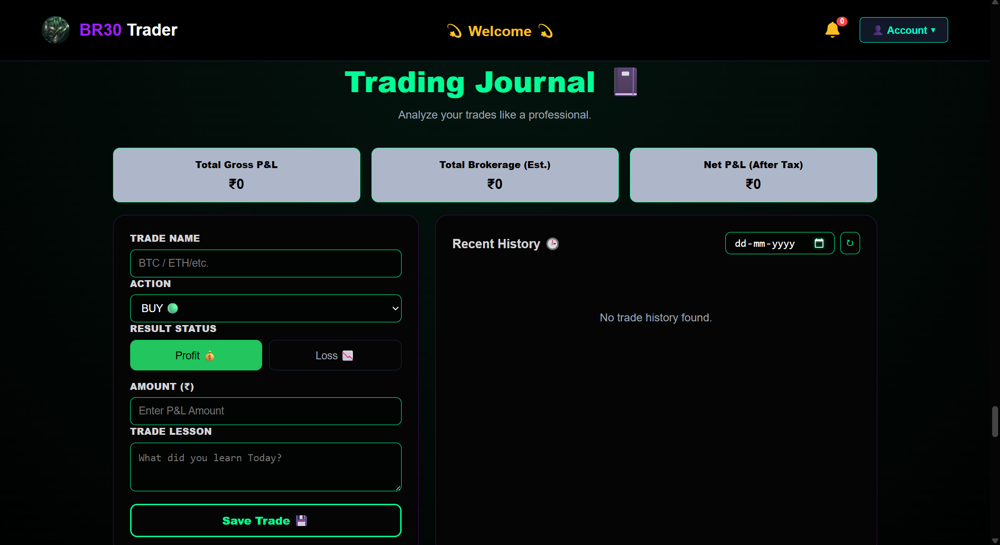

---

### 🛡️ Certificate Verification

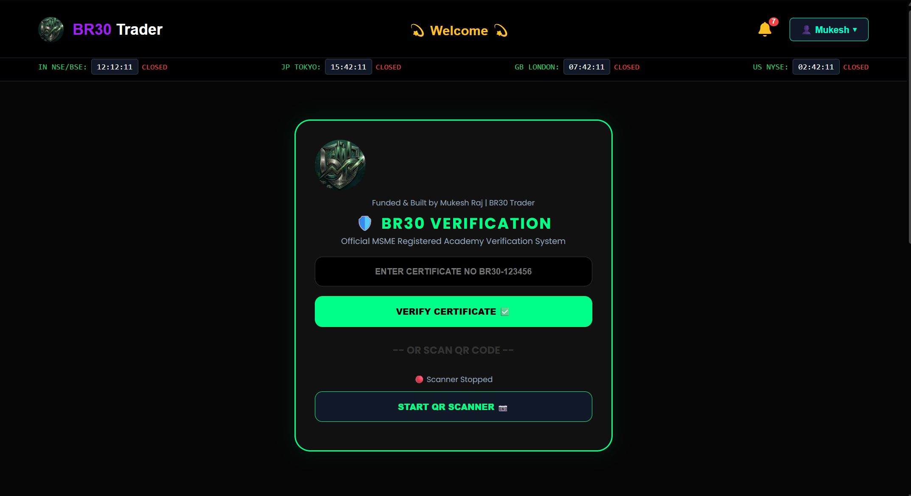

---

### ⚙️ Admin Dashboard

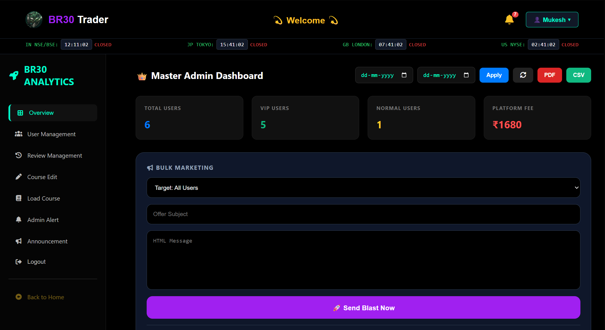

---

### 🧠 Daily Discipline Page

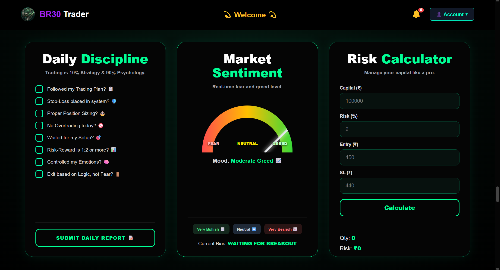

---

### 🔻 Footer Section

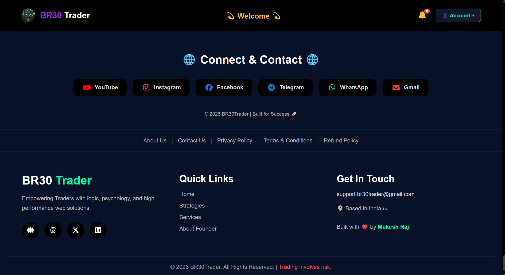

---

## 👨‍💻 Developed By

**Mukesh Raj**  
Founder — **BR30 Group**

---

## 📬 Connect With Me

### 🌐 Professional Network

[](https://www.linkedin.com/in/mukeshraj-br30/) [](https://github.com/mukeshkumarsingh7488-afk)

### 📱 Social Media

[](https://www.instagram.com/br30Traderofficial) [](https://www.youtube.com/@br30traderofficial) [](https://www.facebook.com/share/1DDJYGYYDf/) [](https://x.com/MukeshKuma48159) [](https://www.threads.com/@br30traderofficial)

### 💬 Community

[](https://t.me/+hBAT4kWo63A4ZWY1) [](https://chat.whatsapp.com/B4t82SWBcgOIZTeQXp1wDI)

### 📧 Contact

[](mailto:support.br30trader@gmail.com)

[](mailto:br30service.contact@gmail.com)

### 🚀 BR30 Ecosystem

[](https://my-frontend-eight-roan.vercel.app/)

[](https://br-30-group-com.vercel.app/)

[](https://br-30-kart.vercel.app/)

[](https://br30-com.vercel.app/)

[](https://br30algo-com.vercel.app/)

[](https://br30marketscanner-com-frontade.vercel.app/)


---

## 🚀 Project Status

This project is actively maintained and improved with new features, SEO updates, UI improvements and platform enhancements.

---

### Build • Learn • Trade • Grow 🚀

